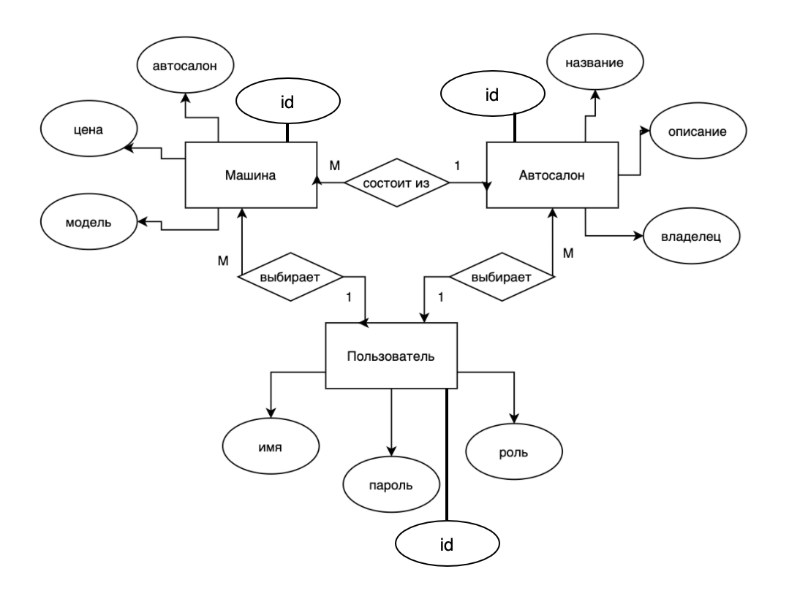

# Web
Web-приложение для дисциплины Веб-программирование.

## Цель работы
Разработать приложение-агрегатор для аренды авто, которое позволит взять машину в разных автосалонах.

## Перечень функциональных требований
- Регистрация пользователя
- Авторизация пользователя
- Просмотр автосалонов
- Просмотр списка машин автосалона
- Аренда/возврат машины

## Use-case диаграмма системы
### Неавторизованный пользователь

### Авторизованный пользователь - арендующий

### Авторизованный пользователь - дилер

## ER-диаграмма в нотации Чена

